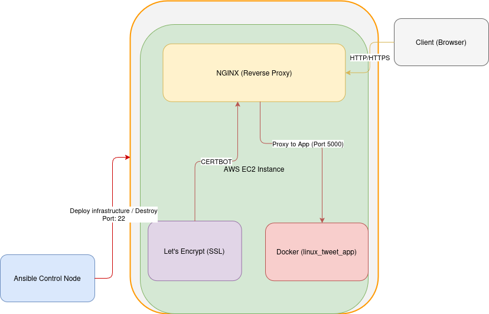

# Automating NGINX Reverse Proxy with Let's Encrypt and Dockerized App Deployment

## Overview
This project automates the deployment of an NGINX reverse proxy with Let's Encrypt SSL certificates and a Dockerized web application (`linux_tweet_app`) using Ansible.

## Architecture
 

## Prerequisites

### AWS EC2 Instance
1. Launch an Ubuntu-based EC2 instance (e.g., Ubuntu 20.04 or 22.04).
2. Ensure the security group allows inbound traffic on:
   - **Port 22**: For SSH access.
   - **Port 80**: For HTTP traffic.
   - **Port 443**: For HTTPS traffic.

### Private Key File
- Ensure you have the private key file (`.pem`) used to connect to the EC2 instance.

### Ansible Installed Locally
1. Install Ansible on your local machine:
   ```bash
   sudo apt update
   sudo apt install ansible -y

### Clone the Repository
git clone https://github.com/doruardelean/nginx_ansible.git
cd nginx_ansible

## Roles
1. **`docker` Role**:
   - Installs Docker.
   - Ensures the Docker service is started and enabled.
   - Reloads systemd configuration.

2. **`nginx` Role**:
   - Installs NGINX.
   - Configures NGINX as a reverse proxy.
   - Generates SSL certificates using Let's Encrypt.

3. **`app` Role**:
   - Clones the `linux_tweet_app` repository.
   - Builds and runs the app in a Docker container.

## Variables
| Variable Name         | Description                                      | Default Value                              |
|------------------------|--------------------------------------------------|--------------------------------------------|
| `app_repo`            | Git repository URL for the app                   | `https://github.com/dockersamples/linux_tweet_app.git` |
| `app_dest`            | Directory to clone the app repository            | `/opt/linux_tweet_app`                     |
| `app_image_name`      | Docker image name for the app                    | `linux_tweet_app`                          |
| `app_container_name`  | Docker container name for the app                | `tweet_app`                                |
| `app_port`            | Port on which the app will run                   | `5000`                                     |
| `domain_name`         | Domain name for SSL certificate                  | `example.com`                              |
| `email`               | Email address for Let's Encrypt registration     | `admin@example.com`                        |

## Configure SSH Access
Ensure you can SSH into the EC2 instance:
ssh -i "/home/doru/1Projects/ansible-demo-key.pem" ubuntu@ec2-34-247-159-33.eu-west-1.compute.amazonaws.com

## Update the Ansible Inventory
update the inventory file in the project directory to include the EC2 instance:

[web]
<ec2-public-ip> ansible_user=ubuntu ansible_ssh_private_key_file=/path/to/your-key.pem

## Playbook Workflow
1. **Setup Playbook (`setup.yml`)**:
   - Executes the `docker`, `nginx`, and `app` roles in sequence.
    Run all roles with this command:
        ansible-playbook -i inventory/dev/hosts site.yml
     To run only a specific role, you can use the --tags option with the ansible-playbook command. For example, if you want to run only the docker role, you can execute:
        ansible-playbook site.yml -i inventory/dev/hosts --tags "nginx"

    Open a browser and navigate to:  https://<your-domain>

2. **Cleanup Playbook (`cleanup.yml`)**:
   - Removes all components installed by the setup playbook.
    Run it with this command: 
        ansible-playbook ansible/cleanup.yml -i inventory
    optional we can verify the cleanup:
        docker --version
        nginx -v
        certbot --version
        dpkg -l | grep nginx
## Error Handling
- Docker readiness is ensured using the `wait_for` module.
- Tasks that may fail harmlessly (e.g., stopping services) use `ignore_errors: true`.


## Future Improvements
- Add health checks for the deployed application.
- Automate SSL certificate renewal.
- Add Molecule tests for role validation.